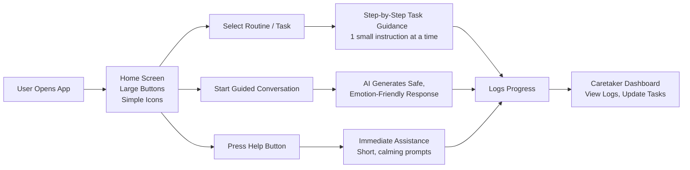
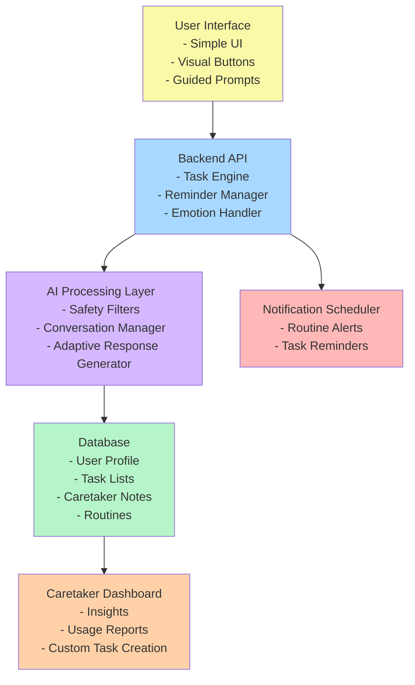

# 🌟 Smart Assistive System for Intellectually Disabled Individuals

A fully software-based assistive platform designed to help intellectually disabled individuals manage daily routines through guided tasks, reminders, and communication support.

---

## 📌 Executive Summary
This system empowers intellectually disabled individuals by offering step-by-step task guidance, daily schedules, communication tools, and caregiver dashboards. The focus is on simplicity, accessibility, and independence, without relying on any hardware. It reduces caregiver burden and enables structured daily living.

---

## 🎯 Approach

- Accessible web/mobile application  
- Large buttons, minimal text, friendly visuals  
- Step-by-step audio–visual task guidance  
- Text-to-speech & speech-to-text communication aid  
- Routine tracking and caregiver reports  
- Visual & audio reminders  

---

## 🧩 Tech Stack

**Frontend:** HTML, CSS, Bootstrap, JavaScript / React  
**Backend:** Python Flask  
**Database:** SQLite / PostgreSQL  
**AI:** gTTS, SpeechRecognition, Google Speech APIs  

---

## 🔄 Workflow







# 🔄 System Workflow for Assistive System for Intellectually Disabled Individuals

This document explains how the system operates from both user and technical perspectives. The goal is to provide a clear understanding of how daily tasks, reminders, communication assistance, and caregiver interactions flow through the application.

---

# 1. 🌟 High-Level User Workflow

This workflow represents the daily interaction of an intellectually disabled user with the assistive system.

```mermaid
flowchart TD

    A[Start] --> B[User Login]
    B --> C[Dashboard Loads]

    C --> D[View Daily Tasks]
    C --> E[See Reminders]
    C --> F[Use Communication Aid]

    D --> G[Open Task]
    G --> H[Step-by-Step Guidance]
    H --> I[Task Completed]

    F --> J[Speech to Text / Text to Speech]

    I --> K[Progress Updated]
    K --> L[Caregiver View Updated]

    L --> M[End]


flowchart LR

    subgraph UserInteraction[User Interaction Layer]
        A[Login] --> B[Dashboard]
        B --> C[Task Selection]
        B --> D[Communication Tool]
        B --> E[Reminders Triggered]
    end

    subgraph TaskFlow[Task Guidance Module]
        C --> F[Load Step-by-Step Instructions]
        F --> G[Audio + Visual Cues]
        G --> H[Mark Step Complete]
        H --> I[Final Task Completion]
    end

    subgraph CommFlow[Communication Module]
        D --> J[Speech to Text]
        D --> K[Text to Speech]
    end

    subgraph NotificationFlow[Reminder & Alerts]
        E --> L[Visual Reminder]
        E --> M[Audio Reminder]
    end

    subgraph BackendFlow[Backend Processing]
        I --> N[Update Database]
        J --> N
        K --> N
        L --> N
        M --> N
    end

    N --> O[Caregiver Dashboard]


sequenceDiagram
    participant U as User
    participant FE as Frontend UI
    participant BE as Backend API
    participant DB as Database
    participant AI as TTS/STT Engine

    U->>FE: Login / Select Task
    FE->>BE: GET /tasks
    BE->>DB: Fetch tasks
    DB-->>BE: Task list
    BE-->>FE: Return task data

    U->>FE: Open Task
    FE->>BE: GET /task/{id}
    BE->>DB: Fetch instructions
    DB-->>BE: Return steps
    BE-->>FE: Steps with images + audio paths

    U->>FE: "Next Step" Click
    FE->>FE: Play Audio + Show Visual

    U->>FE: Task Completed
    FE->>BE: POST /task/complete
    BE->>DB: Update completion record

    U->>FE: Speak Message
    FE->>BE: POST /stt
    BE->>AI: Convert Speech to Text
    AI-->>BE: Text result
    BE-->>FE: Show text to user

    FE->>BE: POST /tts
    BE->>AI: Generate Speech
    AI-->>BE: Audio file
    BE-->>FE: Play audio

    BE->>DB: Push Updates
    DB-->>BE: Success
    BE-->>FE: Update Caregiver Dashboard


