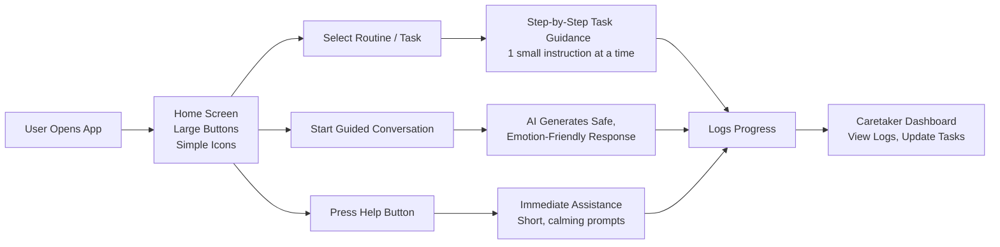
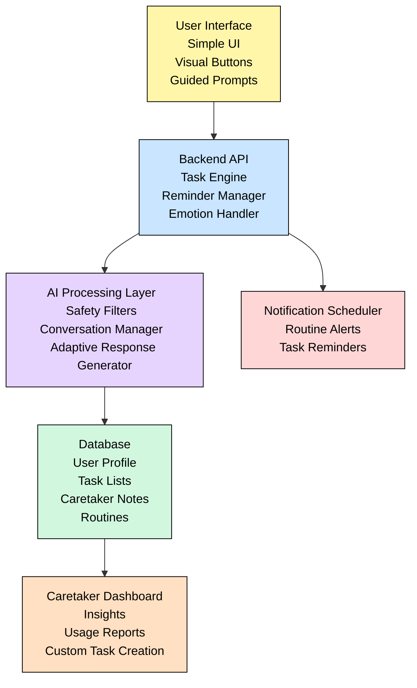
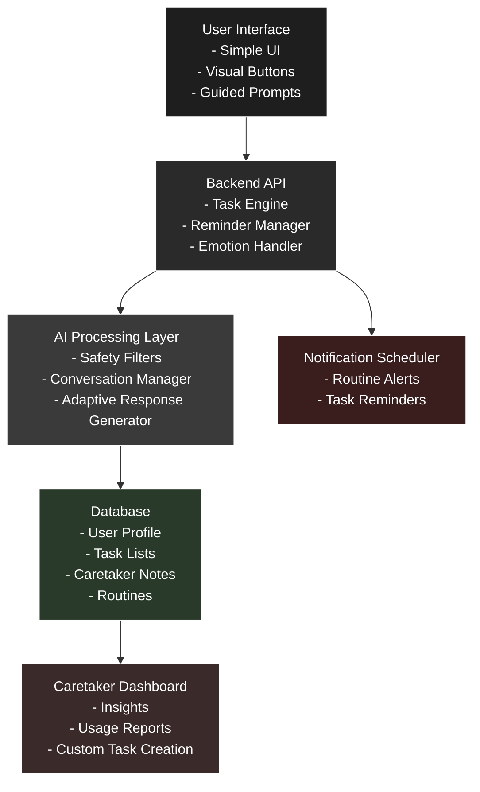

# 🌟 Smart Assistive System for Intellectually Disabled Individuals

A fully software-based assistive platform designed to help intellectually disabled individuals manage daily routines through guided tasks, reminders, and communication support.

---

## 📌 Executive Summary

This system empowers intellectually disabled individuals by offering step-by-step task guidance, daily schedules, communication tools, and caregiver dashboards. The focus is on simplicity, accessibility, and independence, without relying on any hardware. It reduces caregiver burden and enables structured daily living.

---

## 🎯 Approach

- Accessible web/mobile application  
- Large buttons, minimal text, friendly visuals  
- Step-by-step audio–visual task guidance  
- Text-to-speech & speech-to-text communication aid  
- Routine tracking and caregiver reports  
- Visual & audio reminders  

---

## 🧩 Tech Stack

**Frontend:** HTML, CSS, Bootstrap, JavaScript / React  
**Backend:** Python Flask  
**Database:** SQLite / PostgreSQL  
**AI:** gTTS, SpeechRecognition, Google Speech APIs  

---

## 🔄 Workflow





# 🔄 System Workflow for Assistive System for Intellectually Disabled Individuals

This document explains how the system operates from both user and technical perspectives. The goal is to provide a clear understanding of how daily tasks, reminders, communication assistance, and caregiver interactions flow through the application.

---



### SaharaAI — Detailed Workflow

**Legend:**  

- PWID/User = person with intellectual disability using the guided UI.  
- Caregiver = teacher/hostel staff entering quick logs, tags, reports.  
- Doctor = clinician reviewing flagged cases & reports.  
- Admin = system administrator (user management, settings, integrations).  
- TTS = Text-to-Speech (plays instructions). STT = optional Speech-to-Text.

```mermaid
flowchart TD
  %% --- Swimlanes for roles ---
  subgraph UserLane["PWID / User"]
    direction TB
    U_UI[Guided UI\n(Big buttons + Icons + TTS)]
    U_Action[Performs Step / Tap "Next"]
    U_Help[Press Help / Repeat]
  end

  subgraph CaregiverLane["Caregiver (Teacher/Staff)"]
    direction TB
    C_Quick[Quick Log / Tap Tags\n(3s)]
    C_Voice[Optional: 5s Voice Note]
    C_Upload[Upload Report (PDF/Image)]
    C_Review[View Dashboard & Alerts]
    C_Escalate[Escalate to Doctor]
  end

  subgraph AILane["AI / Processing"]
    direction TB
    AI_Ingest[Data Ingest\n(Logs, Voice, Reports)]
    OCR[OCR + NLP\n(Report Parsing)]
    Pattern[Behaviour Pattern Detection\n(Trend engine)]
    Risk[Risk Scoring & Alerts]
  end

  subgraph BackendLane["Backend / Services"]
    direction TB
    API[REST / GraphQL API]
    TaskEngine[Task Engine\nRoutines & Steps]
    Sync[Offline Sync Queue]
    Notifier[Notification Scheduler\n(FCM / Push)]
    Auth[Auth & Roles (JWT)]
  end

  subgraph StorageLane["Storage"]
    direction TB
    DB[(Postgres/SQLite\nEncrypted Logs & Profiles)]
    Blob[Object Storage\n(Reports, Audio)]
  end

  subgraph DoctorLane["Doctor / Clinician"]
    direction TB
    D_Review[Review Flagged Cases\nView Reports & Timeline]
    D_Annotate[Add Clinical Notes / Recommendations]
    D_Consult[Teleconsult / Follow-up]
  end

  subgraph AdminLane["Admin"]
    direction TB
    A_Manage[User & Device Management]
    A_Settings[System Settings\nModel & Thresholds]
    A_Logs[Audit & Usage Logs]
  end

  %% --- User flows ---
  U_UI -->|TTS instruction| U_Action
  U_Action -->|Step event| API
  U_Help -->|Help event| API

  %% --- Caregiver flows ---
  C_Quick -->|Quick log| API
  C_Voice -->|Audio upload| Blob
  C_Upload -->|Report upload| Blob
  C_Upload -->|trigger OCR| OCR

  %% --- Backend ingestion & storage ---
  API --> TaskEngine
  TaskEngine --> DB
  API --> Sync
  Sync --> DB
  Blob --> OCR
  OCR --> AI_Ingest

  %% --- AI processing pipeline ---
  API --> AI_Ingest
  AI_Ingest --> Pattern
  Pattern --> Risk
  Risk --> Notifier
  Pattern --> DB
  AI_Ingest --> DB

  %% --- Notifications & dashboards ---
  Notifier --> C_Review
  Notifier --> U_UI
  DB --> C_Review
  DB --> D_Review

  %% --- Caregiver escalation & doctor loop ---
  C_Review --> C_Escalate
  C_Escalate --> D_Review
  D_Review --> D_Annotate
  D_Annotate --> DB
  D_Consult -->|if needed| API

  %% --- Admin connections ---
  A_Manage --> Auth
  A_Settings -->|tune thresholds| Risk
  A_Logs --> DB

  %% --- Optional STT path (caregiver quick notes) ---
  C_Voice -->|optional STT| API
  API -->|STT text| AI_Ingest

  %% --- Offline resilience ---
  U_Action ---|if offline| Sync
  C_Quick ---|if offline| Sync
  Sync -->|sync when online| API

  %% --- Escalation paths and audit ---
  Risk -->|high score| Notifier
  Notifier -->|urgent| D_Review
  Notifier -->|caregiver| C_Review
  DB --> A_Logs

  classDef role fill:#f7f9fc,stroke:#cbd5e1;
  class UserLane,CaregiverLane,DoctorLane,AdminLane role;


