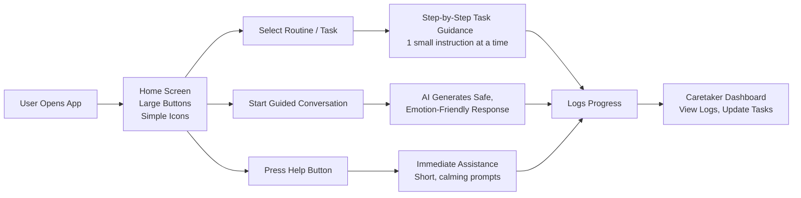
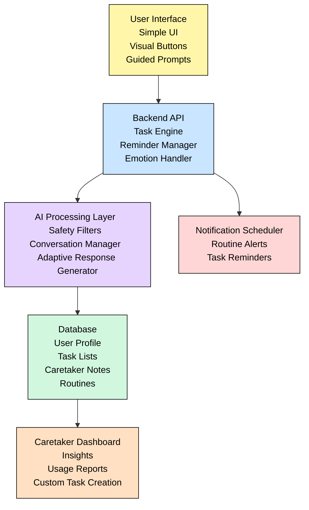
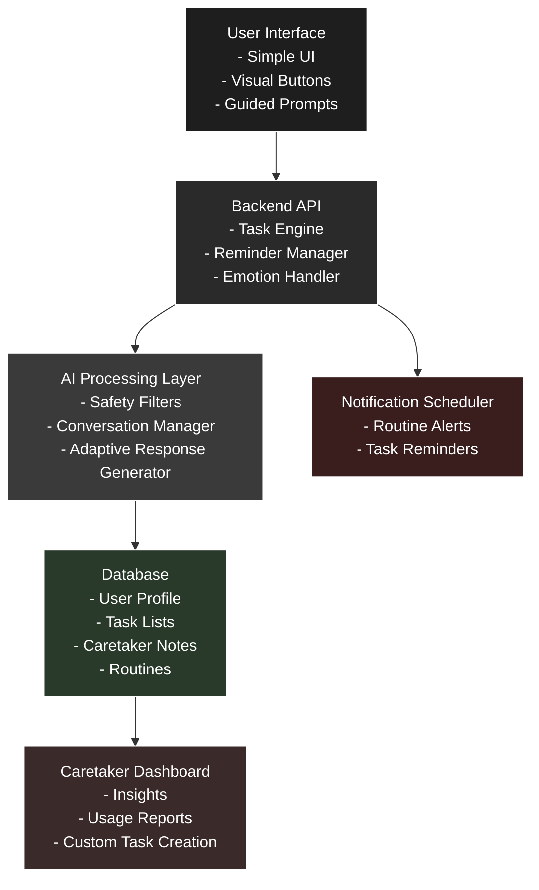

# 🌟 Smart Assistive System for Intellectually Disabled Individuals

A fully software-based assistive platform designed to help intellectually disabled individuals manage daily routines through guided tasks, reminders, and communication support.

---

## 📌 Executive Summary
This system empowers intellectually disabled individuals by offering step-by-step task guidance, daily schedules, communication tools, and caregiver dashboards. The focus is on simplicity, accessibility, and independence, without relying on any hardware. It reduces caregiver burden and enables structured daily living.

---

## 🎯 Approach

- Accessible web/mobile application  
- Large buttons, minimal text, friendly visuals  
- Step-by-step audio–visual task guidance  
- Text-to-speech & speech-to-text communication aid  
- Routine tracking and caregiver reports  
- Visual & audio reminders  

---

## 🧩 Tech Stack

**Frontend:** HTML, CSS, Bootstrap, JavaScript / React  
**Backend:** Python Flask  
**Database:** SQLite / PostgreSQL  
**AI:** gTTS, SpeechRecognition, Google Speech APIs  

---

## 🔄 Workflow

# 🔄 System Workflow for Assistive System for Intellectually Disabled Individuals

This document explains how the system operates from both user and technical perspectives. The goal is to provide a clear understanding of how daily tasks, reminders, communication assistance, and caregiver interactions flow through the application.

---

